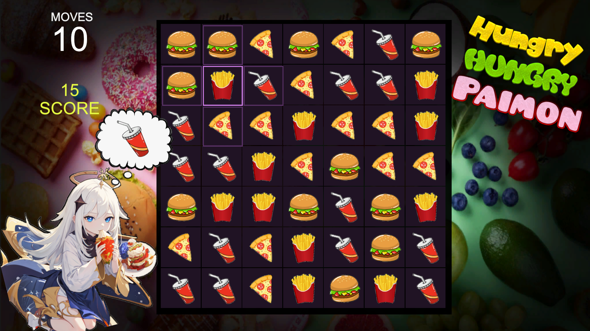

# Hungry Hungry Paimon (Match 3 minigame) by PlayCompile

A simple match-3 minigame built in Unity by PlayCompile. Created live on stream across multiple streaming sessions.

- Twitch: https://twitch.tv/playcompile
- YouTube: https://www.youtube.com/@playcompile



To simply play the game, download from the Releases tab!
- Here: https://github.com/PlayCompile/HungryPaimon/releases/tag/game

## Features
- Randomly generated game board with potential matches
- Horizontal and vertical matching and scoring
- Animation, sound effects and music
- Limited moves with extra moves for large matches (3+)
- Craving system scoring double points for requested food

## Installation and Setup (Unity Project)
1. **Clone the repository:**
   ```bash
   git clone https://github.com/PlayCompile/HungryPaimon.git
